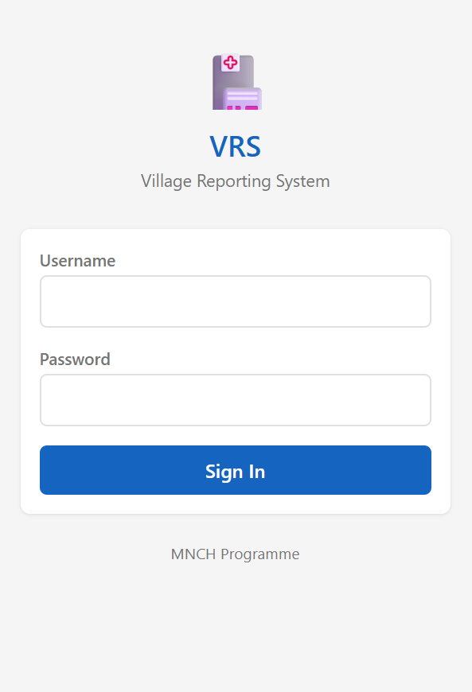
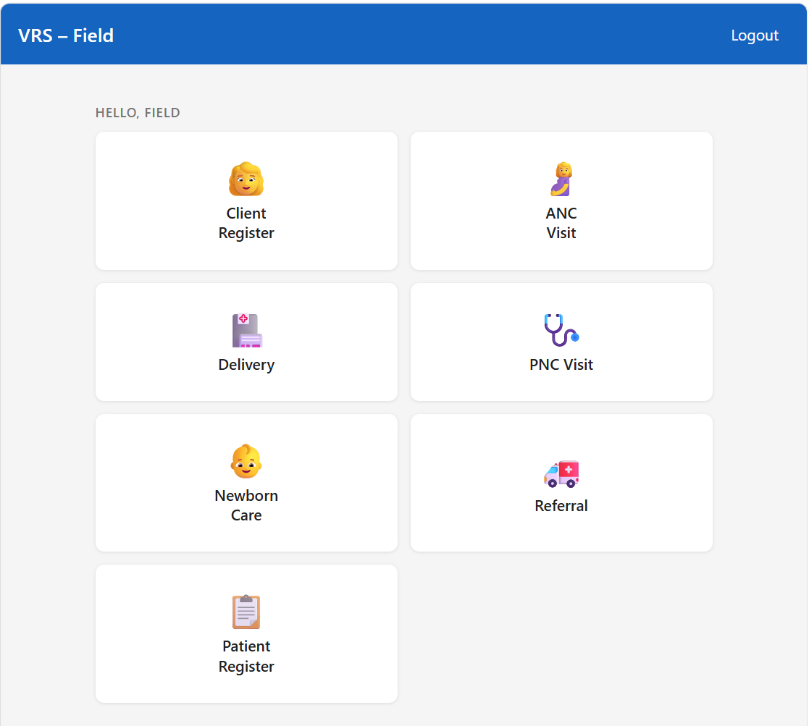
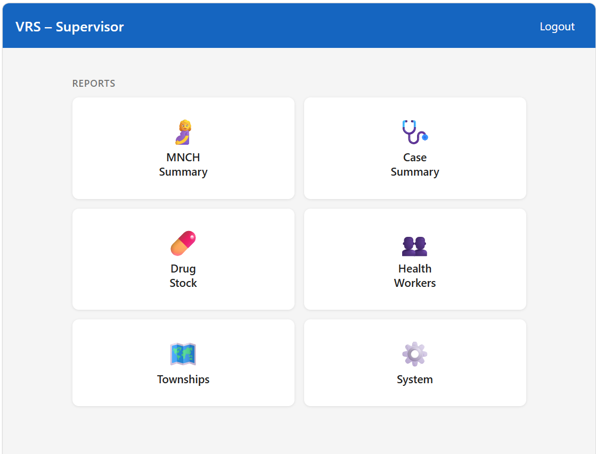

# VRS – Village Reporting System (Web)

**VRS v2, 2019** is a Progressive Web App (PWA) that digitises the MNCH (Maternal, Newborn & Child Health) field reporting workflow used by Community Health Workers (CHW) and Auxiliary Midwives (AMW) in rural townships, and provides supervisors with real-time aggregated reports — all without any server backend.

🌐 **Live demo:** [https://admin-pss.github.io/PS-VRS-WEB/](https://admin-pss.github.io/PS-VRS-WEB/)

---

## Screenshots

| Login | Field User | Supervisor |
|-------|-----------|------------|
|  |  |  |

---

## Table of Contents

1. [Project Overview](#1-project-overview)
2. [Technology Stack](#2-technology-stack)
3. [Quick Start](#3-quick-start)
4. [User Roles & Routing](#4-user-roles--routing)
5. [Application Pages](#5-application-pages)
6. [Data Architecture](#6-data-architecture)
7. [Full Data Model](#7-full-data-model)
8. [MNCH Clinical Workflow](#8-mnch-clinical-workflow)
9. [iCCM VHW Workflow](#9-iccm-vhw-workflow)
10. [Supervisor Reports](#10-supervisor-reports)
11. [Seed Data](#11-seed-data)
12. [Geographic Hierarchy](#12-geographic-hierarchy)
13. [Schema Migrations](#13-schema-migrations)
14. [Development Notes](#14-development-notes)

---

## 1. Project Overview

### Real-world context

The MNCH programme deployed CHWs and AMWs at village level to provide:

- Antenatal care (ANC) visits
- Supervised deliveries and CDK (Clean Delivery Kit) distribution
- Postnatal care (PNC) and newborn care (NBC) follow-up
- iCCM (integrated Community Case Management) for childhood illnesses — pneumonia, diarrhoea, fever — through Village Health Workers (VHW)

The original VRS was a Microsoft Access `.accdb` database used at RHC (Rural Health Centre) level. This web app replaces the paper and Access data-entry layer with a mobile-friendly PWA that field workers can use on a smartphone or tablet, including in areas with no connectivity.

### Who uses it

| Role | Who they are |
|------|-------------|
| Field worker (CHW/AMW) | Community Health Worker or Auxiliary Midwife — enters clinical data at the village |
| Supervisor | Township or programme staff — reviews aggregated reports |
| System/DB Admin | Programme manager — manages users and can reset the database |

---

## 2. Technology Stack

| Layer | Technology | Version | Purpose |
|-------|-----------|---------|---------|
| UI framework | React | 19 | Component-based UI |
| Language | TypeScript | ~6.0 | Type safety across the whole codebase |
| Build tool | Vite | 8 | Fast dev server and production bundler |
| Routing | React Router | 7 | Client-side navigation |
| Local database | Dexie.js | 4 | IndexedDB wrapper (see below) |
| Reactive queries | dexie-react-hooks | 4 | `useLiveQuery` — auto-rerenders on DB change |
| CSV parsing | PapaParse | 5 | Parses seed CSV files at first load |
| PWA | vite-plugin-pwa | 1 | Service worker + Web App Manifest |
| Service worker runtime | workbox-window | 7 | Precaches all assets for offline use |

### Why Dexie / IndexedDB?

The application is explicitly **serverless**. All clinical data is stored in the browser's IndexedDB via Dexie.js. This design means:

- Field workers can enter data with zero connectivity.
- No infrastructure to manage, provision, or secure.
- Data persists across sessions in the same browser profile.
- `useLiveQuery` from dexie-react-hooks makes any component automatically re-render when the underlying IndexedDB data changes, replacing the need for manual state management or API polling.

The trade-off is that data does not automatically sync between devices. Synchronisation (if needed) would be implemented separately.

### PWA manifest (from `vite.config.ts`)

| Property | Value |
|----------|-------|
| `name` | VRS – Village Reporting System |
| `short_name` | VRS |
| `display` | standalone |
| `orientation` | portrait |
| `theme_color` | #1565C0 |
| Service worker strategy | autoUpdate (Workbox precaches `**/*.{js,css,html,ico,png,svg,json,woff2}`) |

---

## 3. Quick Start

```bash
# 1. Install dependencies
npm install

# 2. Start the development server
npm run dev

# 3. Open http://localhost:5173 in a browser
```

On first load the app detects an empty database and automatically seeds all reference tables from the CSV files in `public/seed/`.

### Build for production

```bash
npm run build   # runs tsc then vite build
npm run preview # serves the dist/ folder locally
```

### Login credentials (seeded from `public/seed/sys_user.csv`)

| Username | Password | User Level | Access |
|----------|----------|------------|--------|
| `Admin` | `Admin` | 5 – DB Admin | Supervisor dashboard + System page + Reset DB |
| `User` | `User` | 2 – Read Only | Supervisor dashboard (read only) |
| `Field` | `Field` | 4 – Edit | Field data entry |

---

## 4. User Roles & Routing

User levels are stored in `sys_userLevel` and `sys_user`. The `AuthContext` reads them from IndexedDB at login and persists the session in `sessionStorage` under the key `vrs_user`.

| Level | Name | Default Route | Write Access | Notes |
|-------|------|--------------|--------------|-------|
| 1 | System Admin | `/supervisor` | Yes | Can see users list and Reset DB button |
| 2 | Read Only | `/supervisor` | No | Reports only; `canWrite()` returns false |
| 3 | Read/Write | `/field` | Yes | Full field data entry |
| 4 | Edit | `/field` | Yes | Full field data entry |
| 5 | DB Admin | `/supervisor` | Yes | Can see users list and Reset DB button |

The routing logic in `App.tsx`:

- Levels 1, 2, and 5 are redirected to `/supervisor`.
- Levels 3 and 4 are redirected to `/field`.
- The `/clinic/*` route exists but is a placeholder with stub menu items.
- Any unmatched path redirects to `/` which then applies the role-based redirect.

`canWrite(level)` returns `true` for levels 1, 3, 4, and 5. It is used to conditionally show the **+ New Client** button in `ClientList`.

---

## 5. Application Pages

### Authentication

| Route | Component | Description |
|-------|-----------|-------------|
| `/login` | `Login` | Username/password form. Credentials are validated against `sys_user` in IndexedDB. Failed login throws "Invalid username or password". |

### Field section (`/field/*`)

Accessible to all authenticated users; write operations gated by `canWrite()`.

| Route | Component | Description |
|-------|-----------|-------------|
| `/field` | `FieldMenu` | Home screen grid with 7 shortcut tiles |
| `/field/clients` | `ClientList` | Lists the 100 most recently registered clients (ordered by `Client_StartDate` descending). Shows a **+ New Client** button for users with write access. |
| `/field/clients/new` | `ClientForm` | Registration form for a new pregnant client. Captures name, age, village, health worker, gravida/para, LMP, birth plan, and remarks. Generates `Client_ID` as `{HW_ID}-{YYYYMMDD}-{last4msec}`. Derives `TS_Pcode`, `RHC_Code`, `SRHC_Code` automatically from the selected village. |
| `/field/anc` | `ANCForm` | Records an ANC visit against an existing client. Captures vital signs (BP, weight), findings (FHS, anaemia, danger sign), CDK, deworming, 10 health education topics, and supplement quantities (iron/folate, Vita B1, TT dose). Auto-increments `ANC_Sr` per client. |
| `/field/delivery` | `DeliveryForm` | Records a delivery outcome. Captures delivery date/time, mode, attendant, mother outcome, bleeding, CDK use, child outcome, weight, sex, place, breastfeeding within 1 hour, and respiration. |
| `/field/pnc` | `PNCForm` | Records a PNC visit. Captures temperature, BP, anaemia, iron/folate, Vita B1, Vita A, and 10 health education topics. Auto-increments `PNC_Sr` per client. |
| `/field/nbc` | `NBCForm` | Records a newborn care contact. Captures weight, KGLB, temperature, birth defect, warming, cord care, chlorhexidine, EBF, jaundice, respiration, skin, and danger signs. Auto-increments `NBC_Sr` per client. |
| `/field/referral` | `ReferralForm` | Records a referral. Captures date, mother/child/both, destination site, reason, completeness, and outcome. |
| `/field/vhw` | `VHWForm` | VHW (Village Health Worker) iCCM patient register entry. One form per patient encounter. Full detail in [section 9](#9-iccm-vhw-workflow). |

### Supervisor section (`/supervisor/*`)

Accessible to all authenticated users; shows aggregated read-only reports.

| Route | Component | Description |
|-------|-----------|-------------|
| `/supervisor` | `SupervisorMenu` | Home screen grid with 6 report tiles |
| `/supervisor/mnch` | `MNCHSummary` | Monthly MNCH summary report. Filter by year, month, and optionally RHC. See [section 10](#10-supervisor-reports). |
| `/supervisor/cases` | `CaseSummary` | Monthly iCCM case summary. Filter by year, month, and optionally health worker. |
| `/supervisor/drugs` | `DrugStock` | Drug dispensing totals from VHW register for a given month. Filter by health worker. |
| `/supervisor/hw` | `HealthWorkers` | Directory of all CHW/AMW. Filter by name, RHC, and type (CHW/AMW). Shows CCM trained, CBNBC trained, and VRS trained flags. |
| `/supervisor/townships` | `Townships` | Expandable hierarchy browser: Township → RHC (with 2019 population stats) → Sub-RHC → Villages (hard-to-reach villages marked with ⚠). |
| `/supervisor/system` | `SystemPage` | Record counts for all tables. Admin/DB Admin users also see the user list and the **Reset Local Database** button. |

### Clinic section (`/clinic/*`)

| Route | Component | Description |
|-------|-----------|-------------|
| `/clinic` | `ClinicHome` | Placeholder menu. Drug Stock and Monthly Report items link to `#` (not yet implemented). Client Records links back to `/field/clients`. |

---

## 6. Data Architecture

### IndexedDB via Dexie

The database is named `VRS` (the string passed to `new Dexie('VRS')`). Dexie manages the IndexedDB schema through versioned `stores()` calls in `src/data/db.ts`. The exported singleton `db` is the single point of access for all reads and writes.

Reactive UI updates use `useLiveQuery(() => db.<table>....)` from `dexie-react-hooks`. The hook re-evaluates the query and re-renders the component whenever the queried table(s) change.

### Seeding mechanism (`src/data/seed.ts`)

`seedIfEmpty()` is called once on application startup. It checks whether `sys_township` contains any rows. If the count is zero (fresh install or after a reset), it:

1. Fetches all 11 CSV files from `/seed/` in parallel using the browser `fetch` API.
2. Parses each file with PapaParse (`header: true`, `dynamicTyping: true`).
3. Writes all rows in a single Dexie `transaction('rw', [...tables], ...)` using `bulkPut`.

If the database already has data the function returns immediately without touching any table.

### Re-seeding / Reset

**System → Reset Local Database** (admin only) calls `resetDatabase()` from `db.ts`, which calls `db.delete()` to wipe the entire IndexedDB database and then calls `window.location.reload()`. On reload, `seedIfEmpty()` detects the empty database and re-seeds from CSV.

### Multi-tab safety

Two Dexie event handlers prevent upgrade deadlocks:

- `db.on('versionchange')` — closes the connection and reloads if another tab opens a newer schema version.
- `db.on('blocked')` — reloads if this tab's upgrade is blocked by a tab that did not close its connection.

During Vite HMR development, `import.meta.hot.dispose()` closes the connection before the module is replaced so the new instance can open a clean connection.

---

## 7. Full Data Model

All tables are defined as TypeScript interfaces in `src/data/db.ts`.

### Clinical Tables

#### `clients` — Patient Registration

| Field | Type | Description |
|-------|------|-------------|
| `AutoSr` | number (PK, auto-increment) | Internal row ID |
| `Client_ID` | string (indexed) | Business key: `{HW_ID}-{YYYYMMDD}-{last4msec}` |
| `Client_StartDate` | string (indexed) | Registration date (YYYY-MM-DD) |
| `Client_Name` | string | Full name |
| `Client_Age` | number | Age in years |
| `Client_Village` | number | Village_Pcode (denormalised) |
| `TS_Pcode` | string | Township P-code (compound index with RHC_Code) |
| `RHC_Code` | number | RHC code (compound index with TS_Pcode) |
| `SRHC_Code` | number | Sub-RHC code |
| `Village_Pcode` | number | Village P-code |
| `CHWAMW` | string | Worker type: `"CHW"` or `"AMW"` |
| `HW_ID` | number (indexed) | Health worker ID |
| `Preg_LMP` | string? | Last menstrual period date |
| `Preg_EDD` | string? | Expected delivery date |
| `Preg_G` | number? | Gravida |
| `Preg_P1` | number? | Para (live) |
| `Preg_P2` | number? | Para (dead) |
| `Preg_History` | string? | Free text obstetric history |
| `PastPreg_BOH_YN` | boolean? | Bad obstetric history flag |
| `PastPreg_DeliveredBy` | number? | Lookup: previous delivery attendant |
| `BirthPlan_Place` | string? | Planned delivery location |
| `BirthPlan_Attendant` | number? | Lookup: planned attendant |
| `Client_Remark` | string? | Free text |

#### `anc` — Antenatal Care Visits

| Field | Type | Description |
|-------|------|-------------|
| `AutoSr` | number (PK, auto-increment) | Internal row ID |
| `Client_ID` | string (indexed) | Links to `clients.Client_ID` |
| `ANC_Sr` | number | Visit sequence number per client |
| `ANC_Date` | string (indexed) | Visit date (YYYY-MM-DD) |
| `ANC_PregnancyWeek` | number? | Gestational age in weeks |
| `ANC_BPS` / `ANC_BPD` | number? | Blood pressure (systolic / diastolic) |
| `ANC_Weight` | number? | Weight in kg |
| `ANC_FHS` | boolean? | Foetal heart sound present |
| `ANC_Anemia` | boolean? | Anaemia detected |
| `ANC_DangerSign` | boolean? | Danger sign present |
| `ANC_TT` | number? | Tetanus toxoid dose |
| `ANC_IronFolate` | number? | Iron/folate tablets given |
| `ANC_VitaB1` | number? | Vitamin B1 tablets given |
| `ANC_CDK` | boolean? | Clean delivery kit given |
| `ANC_Deworming` | boolean? | Deworming given |
| `ANC_HE1`–`ANC_HE10` | boolean? | Health education topics 1–10 covered |
| `ANC_Provider` | number? | Lookup: ANC provider |
| `ANC_Presentation` | string? | Foetal presentation |
| `ANC_AbdominalExam` | string? | Abdominal examination notes |
| `ANC_Remark` | string? | Free text |
| `TS_Pcode`, `RHC_Code`, `SRHC_Code`, `Village_Pcode`, `CHWAMW`, `HW_ID` | — | Denormalised geo/HW context (copied from client at entry time) |

#### `delivery` — Delivery Records

| Field | Type | Description |
|-------|------|-------------|
| `AutoSr` | number (PK, auto-increment) | Internal row ID |
| `Client_ID` | string (indexed) | Links to `clients.Client_ID` |
| `Delivery_Date` | string (indexed) | Delivery date (YYYY-MM-DD) |
| `Delivery_Time` | string? | Time of delivery |
| `Delivery_By` | number? | Lookup: delivered by |
| `Delivery_How` | number? | Lookup: mode of delivery |
| `Delivery_MotherOutcome` | number? | Lookup: mother outcome |
| `Delivery_MotherBleeding` | number? | Lookup: post-partum bleeding |
| `Delivery_CDK` | boolean? | CDK used |
| `Delivery_Place` | number? | Lookup: place of delivery |
| `ChildSr` | number? | Child sequence (for multiple births) |
| `Delivery_ChildOutcome` | number? | 1 = Live birth, 2 = Still birth |
| `Delivery_ChildWeight` | number? | Birth weight in grams |
| `Delivery_ChildSex` | number? | 1 = Male, 2 = Female |
| `Delivery_ChildBF` | number? | Lookup: breastfeeding status |
| `Delivery_ChildBF1Hour` | boolean? | Breastfed within 1 hour |
| `Delivery_ChildRespiration` | number? | Lookup: newborn respiration |
| `Delivery_Remark` | string? | Free text |

#### `pnc` — Postnatal Care Visits

| Field | Type | Description |
|-------|------|-------------|
| `AutoSr` | number (PK, auto-increment) | Internal row ID |
| `Client_ID` | string (indexed) | Links to `clients.Client_ID` |
| `PNC_Sr` | number | Visit sequence number per client |
| `PNC_Date` | string (indexed) | Visit date (YYYY-MM-DD) |
| `PNC_Temperature` | number? | Temperature (°C) |
| `PNC_BPS` / `PNC_BPD` | number? | Blood pressure |
| `PNC_Anemia` | boolean? | Anaemia detected |
| `PNC_IronFolate` | boolean? | Iron/folate given |
| `PNC_VitaB1` | number? | Vitamin B1 tablets given |
| `PNC_VitaA` | boolean? | Vitamin A given |
| `PNC_HE1`–`PNC_HE10` | boolean? | Health education topics 1–10 covered |
| `PNC_Remark` | string? | Free text |

#### `nbc` — Newborn Care Contacts

| Field | Type | Description |
|-------|------|-------------|
| `AutoSr` | number (PK, auto-increment) | Internal row ID |
| `Client_ID` | string (indexed) | Links to `clients.Client_ID` (mother) |
| `ChildSr` | number? | Child sequence for multiple births |
| `NBC_Name` | string? | Newborn name |
| `NBC_Sr` | number | Contact sequence number per client |
| `NBC_Date` | string (indexed) | Contact date (YYYY-MM-DD) |
| `NBC_Weight` | number? | Weight in grams |
| `NBC_KGLB` | string? | Weight status (`"KG"` or `"LB"`) |
| `NBC_Temperature` | number? | Temperature (°C) |
| `NBC_BirthDefect` | boolean? | Birth defect present |
| `NBC_Warming` | boolean? | Warming done |
| `NBC_CordDryClean` | boolean? | Cord dry and clean |
| `NBC_CordChlorhexadine` | boolean? | Chlorhexidine applied to cord |
| `NBC_EBF` | boolean? | Exclusive breastfeeding |
| `NBC_Jaundice` | boolean? | Jaundice observed |
| `NBC_Respiration` | boolean? | Respiration assessed |
| `NBC_Skin` | boolean? | Skin assessed |
| `NBC_DangerSign` | boolean? | Danger sign present |
| `NBC_Remark` | string? | Free text |

#### `referral` — Referrals

| Field | Type | Description |
|-------|------|-------------|
| `AutoSr` | number (PK, auto-increment) | Internal row ID |
| `Client_ID` | string (indexed) | Links to `clients.Client_ID` |
| `Ref_Date` | string (indexed) | Referral date (YYYY-MM-DD) |
| `Ref_MorC` | number? | 1 = Mother, 2 = Child, 3 = Both |
| `Ref_DestinationSite` | number? | Lookup: destination facility |
| `Ref_Reason` | string? | Reason for referral |
| `Ref_Completeness` | boolean? | Referral completed (patient arrived) |
| `Ref_Outcome` | string? | Free text outcome |
| `Ref_Remark` | string? | Free text |

#### `vhwRegister` — VHW / iCCM Patient Register

| Field | Type | Description |
|-------|------|-------------|
| `id` | number (PK, auto-increment) | Internal row ID |
| `HW_ID` | number (indexed) | Health worker ID |
| `Report_Month` | number (indexed) | Reporting month (1–12) |
| `Report_Year` | number (indexed) | Reporting year |
| `SrNo` | number | Serial number within HW+month |
| `RegisterDate` | string | Date of patient encounter |
| `Patient_Name` | string | Patient full name |
| `Patient_Sex` | number | Lookup UseID 10 |
| `Patient_AgeInYear` | number | Age in years |
| `Patient_Village` | string? | Village name (denormalised) |
| `Patient_Type` | number? | Lookup UseID 16 (New / Old) |
| `Find_*` (14 fields) | boolean? | Danger sign flags (see section 9) |
| `Find_Other` | string? | Other finding free text |
| `Case_*` (11 fields) | boolean? | Case classification flags |
| `Other_Case` | string? | Other case free text |
| `Treat_ORS` | number? | ORS sachets dispensed |
| `Treat_Zinc` | number? | Zinc tablets dispensed |
| `Treat_ParaSyr` | number? | Paracetamol syrup dispensed |
| `Treat_ParaTab250` | number? | Paracetamol 250 mg tablets |
| `Treat_ParaTab500` | number? | Paracetamol 500 mg tablets |
| `Treat_Amoxil` | number? | Amoxicillin tablets |
| `Treat_Cotrimoxazole` | number? | Cotrimoxazole tablets |
| `Treat_OtherDrug` | string? | Other drug free text |
| `ReferredYN` | boolean? | Patient referred |
| `ArrivedYN` | boolean? | Patient arrived at referral site |
| `Remark` | string? | Free text |
| `TS_Pcode`, `RHC_Code`, `SRHC_Code`, `Village_Pcode`, `CHWAMW` | — | Denormalised geo context |

---

### Reference / System Tables

#### `sys_township` — Townships

| Field | Type | Description |
|-------|------|-------------|
| `TS_PCode` | string (PK) | MIMU township P-code |
| `Township` | string | Township name |
| `Org_Short` | string (indexed) | Implementing organisation short code |
| `Grant_No` | string? | 3MDG grant number |

#### `sys_rhc` — Rural Health Centres

| Field | Type | Description |
|-------|------|-------------|
| `RHC_Code` | number (PK) | RHC code |
| `TS_Pcode` | string (indexed) | Parent township P-code |
| `RHC_Name` | string | RHC name |
| `PopulationByRHC19` | number? | 2019 catchment population |
| `U5PopulationByRHC19` | number? | 2019 under-5 population |
| `ExpPregByRHC19` | number? | 2019 expected pregnancies |
| `LiveBirthByRHC19` | number? | 2019 expected live births |

#### `sys_srhc` — Sub-Rural Health Centres

| Field | Type | Description |
|-------|------|-------------|
| `SRHC_Code` | number (PK) | Sub-RHC code |
| `TS_Pcode` | string | Parent township P-code |
| `RHC_Code` | number (indexed) | Parent RHC code |
| `SRHC_Name` | string | Sub-RHC name |

#### `sys_village` — Villages

| Field | Type | Description |
|-------|------|-------------|
| `Village_Pcode` | number (PK) | MIMU village P-code |
| `TS_Pcode` | string | Parent township P-code |
| `RHC_Code` | number (indexed) | Parent RHC code |
| `SRHC_Code` | number | Parent Sub-RHC code |
| `Village` | string | Village name (English) |
| `Village_Mya` | string? | Village name (Myanmar script) |
| `HardToReach19` | boolean? | Hard-to-reach status (2019) |

#### `sys_chwamw` — Community Health Workers / Auxiliary Midwives

| Field | Type | Description |
|-------|------|-------------|
| `HW_ID` | number (PK) | Health worker ID |
| `TS_Pcode` | string | Township P-code |
| `RHC_Code` | number (compound index) | Assigned RHC |
| `SRHC_Code` | number | Assigned Sub-RHC |
| `Village_Pcode` | number | Assigned village |
| `CHWAMW` | string (indexed) | Worker type: `"CHW"` or `"AMW"` |
| `HW_Name` | string | Full name |
| `HW_Sex` | string? | Sex |
| `CCM_Trained` | boolean? | iCCM-trained flag |
| `CBNBC_Trained` | boolean? | Community-based NBC trained |
| `DualFunctioning` | boolean? | Dual-functioning worker |
| `VRS_Trained` | boolean? | VRS-trained flag |

#### `sys_org` — Organisations

| Field | Type | Description |
|-------|------|-------------|
| `Org_Short` | string (PK) | Short code (e.g. `"IRC"`) |
| `Org_Long` | string | Full organisation name |
| `Type` | string | Organisation type |

#### `sys_drug` — Drug Catalogue

| Field | Type | Description |
|-------|------|-------------|
| `DrugID` | number (PK) | Drug ID |
| `DrugDesp` | string | Drug description |

#### `sys_lookup` — Lookup Values

| Field | Type | Description |
|-------|------|-------------|
| `UseID` | number (compound PK with ID) | Category of lookup (see `sys_lookupMain`) |
| `ID` | number | Option ID within category |
| `Description` | string | Display label |

The `useLookup(useId)` hook in `src/hooks/useLookup.ts` filters this table by `UseID` to populate select boxes. For example, `useLookup(2)` fetches ANC health education topic labels; `useLookup(10)` fetches sex options; `useLookup(16)` fetches patient type options.

#### `sys_lookupMain` — Lookup Categories

| Field | Type | Description |
|-------|------|-------------|
| `UseID` | number (PK) | Category ID |
| `UseDescription` | string | Category name |

#### `sys_userLevel` — User Level Definitions

| Field | Type | Description |
|-------|------|-------------|
| `UserLevel` | number (PK) | Level number (1–5) |
| `LevelDesp` | string | Level description |

#### `sys_user` — Users

| Field | Type | Description |
|-------|------|-------------|
| `UserName` | string (PK) | Login username |
| `Password` | string | Plaintext password (stored in IndexedDB) |
| `UserLevel` | number (indexed) | Foreign key to `sys_userLevel` |

> **Note:** Passwords are stored in plaintext in IndexedDB and the seed CSV. This is acceptable for a local-only, offline PWA in a controlled deployment context, but should be hashed if the app is ever exposed over a network.

---

## 8. MNCH Clinical Workflow

The care pathway follows a pregnant woman from registration through to newborn follow-up. All records after the initial `clients` record are linked by `Client_ID`.

```
[Client Registration]
      |
      | Client_ID
      v
[ANC Visits]  ←─ ANC_Sr (1, 2, 3, 4…)
      |
      | Client_ID
      v
[Delivery]
      |
      | Client_ID  (mother)  +  ChildSr (links to NBC)
      |
      +──────────────────────┐
      v                      v
[PNC Visits]            [NBC Contacts]
  PNC_Sr                  NBC_Sr
      |
      | Client_ID
      v
[Referral]  ←─ Ref_MorC: 1=Mother, 2=Child, 3=Both
```

### Key linkages

- `Client_ID` is the sole join key between `clients`, `anc`, `delivery`, `pnc`, `nbc`, and `referral`.
- The geographic context (`TS_Pcode`, `RHC_Code`, `SRHC_Code`, `Village_Pcode`, `CHWAMW`, `HW_ID`) is **denormalised** into every clinical record at the time of entry (copied from the selected client or village). This avoids JOIN lookups in IndexedDB and allows filtering by RHC or health worker directly on clinical tables.
- `ANC_Sr`, `PNC_Sr`, and `NBC_Sr` are assigned by counting existing records for the same `Client_ID` (`existing + 1`) before inserting.

### ANC quality indicator

The MNCH Summary report counts clients with 4 or more cumulative ANC visits (`anc4Plus`) as a key programme indicator, independent of the selected reporting month.

---

## 9. iCCM VHW Workflow

VHW (Village Health Worker) iCCM is a separate workflow tracked in `vhwRegister`. Unlike MNCH, records are not linked to a registered mother/client — each entry is an independent patient encounter for a sick child or adult.

### Data entry flow

1. Health worker selects the reporting month/year and their name.
2. Enters patient demographics (name, sex, age, village, type: new/old).
3. Checks applicable **danger signs** from a list of 14 flags.
4. Checks applicable **case classifications** from a list of 11 diagnoses.
5. Enters quantities of each **drug dispensed**.
6. Records whether the patient was **referred** and whether they **arrived** at the facility.

### Danger signs captured

`Find_NotDrinkEat`, `Find_Vomit`, `Find_Fit`, `Find_NotWakeUp`, `Find_FastBreath`, `Find_Chest`, `Find_Stridor`, `Find_Blood`, `Find_Restless`, `Find_SunkenEye`, `Find_Thirsty`, `Find_SkinVery`, `Find_SkinSlow`, `Find_Fever`

### Case classifications

| Group | Flags |
|-------|-------|
| Pneumonia | `Case_VerySeverePneumonia`, `Case_SeverePneumonia`, `Case_Pneumonia`, `Case_Cough` |
| Diarrhoea | `Case_DiarrWith`, `Case_DiarrNoWith`, `Case_Dysentry` |
| Persistent cough | `Case_CoughThan21` (≥21 days), `Case_CoughNotThan21` (<21 days) |
| Persistent diarrhoea | `Case_DiarrThan14` (≥14 days), `Case_DiarrNotThan14` (<14 days) |

The `CaseSummary` report classifies each record into Pneumonia, Diarrhoea, or Other by checking which group of flags is set, with Pneumonia taking priority over Diarrhoea.

### Serial number

`SrNo` is assigned as `count(records where TS_Pcode + RHC_Code + HW_ID = selected HW) + 1` at save time — it is a per-health-worker running counter rather than a strictly monthly sequence.

---

## 10. Supervisor Reports

All reports are computed entirely in the browser from IndexedDB using `useLiveQuery`. Filtering is reactive — changing month, year, or RHC/HW selection triggers an immediate re-computation.

### MNCH Summary (`/supervisor/mnch`)

Source tables: `anc`, `delivery`, `pnc`, `nbc`, `referral`  
Filters: year, month, optional RHC

| Section | Metrics computed |
|---------|-----------------|
| ANC | Total ANC visits in period; unique clients seen; clients with 4+ cumulative visits (all-time, filtered by RHC) |
| Deliveries | Live births (M/F/Total); still births (M/F/Total); total deliveries; CDK used count |
| PNC | Unique clients seen; total PNC visits |
| NBC | Total NBC contacts; EBF practiced; danger signs found |
| Referrals | Maternal referrals; child referrals; both; total referred; completed (arrived) |

### Case Summary (`/supervisor/cases`)

Source table: `vhwRegister`  
Filters: year, month, optional health worker

| Section | Metrics computed |
|---------|-----------------|
| Case Counts | Pneumonia / Diarrhoea / Others — each broken down by New/Old, M/F, Under-5/5+, Total |
| Pneumonia sub-types | Very severe / Severe / Non-severe counts |
| Diarrhoea sub-types | With dehydration / Without dehydration / Dysentery |
| Treatment Dispensed | Sum of each drug field across all records in the period |
| Referrals | Total referred; arrived at facility |

### Drug Stock (`/supervisor/drugs`)

Source table: `vhwRegister`  
Filters: year, month, optional health worker

- Shows total quantities dispensed for all 7 drugs in the period.
- Breaks down dispensing per health worker in a matrix table.
- Note: this shows drugs **dispensed** from patient records only. Opening balance and received stock are tracked separately (not in this web app).

### Health Workers (`/supervisor/hw`)

Source table: `sys_chwamw`, `sys_rhc`

- Searchable, filterable directory of all CHWs and AMWs.
- Filters: name search, RHC, type (CHW / AMW).
- Columns: Name, Type badge, RHC name, CCM trained, CBNBC trained, VRS trained.

### Townships (`/supervisor/townships`)

Source tables: `sys_township`, `sys_rhc`, `sys_srhc`, `sys_village`, `sys_chwamw`

- Expandable hierarchy: Township → RHC cards (with 2019 population, under-5, expected pregnancies, births) → Sub-RHC → Village chips.
- Hard-to-reach villages displayed with an ⚠ indicator and amber background.

### System (`/supervisor/system`)

Source: all tables (count queries)

- Reference data counts: townships, RHCs, Sub-RHCs, villages, health workers.
- Clinical record counts: clients, ANC, deliveries, PNC, NBC, referrals, VHW register entries.
- Admin/DB Admin only: user list with level badges; **Reset Local Database** button.

---

## 11. Seed Data

All reference (system) data is shipped as CSV files in `public/seed/`. The app fetches these files at runtime on first load.

| File | Dexie table | Source Access table | Contents |
|------|-------------|--------------------|---------  |
| `sys_township.csv` | `sys_township` | `tblSys_Township1` | Township names, P-codes, implementing org |
| `sys_rhc.csv` | `sys_rhc` | `tblSys_RHC1` | RHC names, codes, 2019 population stats |
| `sys_srhc.csv` | `sys_srhc` | `tblSys_SRHC1` | Sub-RHC names and codes |
| `sys_village.csv` | `sys_village` | `tblSys_Village1` | Village names, P-codes, hard-to-reach flag |
| `sys_chwamw.csv` | `sys_chwamw` | `tblSys_CHWAMW1` | CHW/AMW names, IDs, training flags |
| `sys_org.csv` | `sys_org` | `tblSys_Org` | Implementing organisation names |
| `sys_drug.csv` | `sys_drug` | `tblSys_Drug` | Drug catalogue |
| `sys_lookup.csv` | `sys_lookup` | `tblSys_LookUp` | Lookup option values (all categories) |
| `sys_lookupMain.csv` | `sys_lookupMain` | `tblSys_LookUpMain` | Lookup category names |
| `sys_userLevel.csv` | `sys_userLevel` | `tblSys_UserLevel` | Level 1–5 descriptions |
| `sys_user.csv` | `sys_user` | `tblSys_User` | Login credentials |

### Re-seeding

If reference data changes in the source Access database, re-run `export-seed-data.ps1` (inside the `vrs-web/` directory):

```powershell
.\export-seed-data.ps1
# Optionally override paths:
.\export-seed-data.ps1 -DbPath "..\VRS_V2_2019.accdb" -OutDir "public\seed"
```

The script connects to the Access database via the Microsoft ACE OLEDB 16.0 provider and exports all 11 tables to UTF-8 CSV. It uses the `*1` table variants for geographic/HW data (e.g. `tblSys_Township1` not `tblSys_Township`) because in the Access schema the `*1` tables hold the master reference data while the plain `tblSys_*` tables are staging/sync buffers.

After running the script, open the web app and use **System → Reset Local Database** to wipe the existing seed data and reload from the updated CSV files.

---

## 12. Geographic Hierarchy

The geographic reference data follows Myanmar's MIMU (Myanmar Information Management Unit) P-code system.

```
Township  (TS_PCode)
  └── RHC – Rural Health Centre  (RHC_Code)
        └── SRHC – Sub-Rural Health Centre  (SRHC_Code)
              └── Village  (Village_Pcode)
                    └── CHW/AMW  (HW_ID)
```

All clinical records carry the full four-level geographic context (`TS_Pcode`, `RHC_Code`, `SRHC_Code`, `Village_Pcode`) denormalised at entry time. This allows the supervisor reports to filter at any level without JOINs.

### Compound indexes in Dexie

Several tables use compound indexes to enable efficient geographic filtering:

| Table | Compound index | Used for |
|-------|---------------|---------|
| `clients` | `[TS_Pcode+RHC_Code]` | Filter clients by RHC |
| `anc`, `delivery`, `pnc`, `nbc`, `referral` | `[TS_Pcode+RHC_Code]` | Filter clinical records by RHC |
| `sys_srhc` | `[TS_Pcode+RHC_Code]` | Look up Sub-RHCs within an RHC |
| `sys_village` | `[TS_Pcode+RHC_Code+SRHC_Code]` | Look up villages within a Sub-RHC |
| `sys_chwamw` | `[TS_Pcode+RHC_Code]` | List HWs within an RHC |
| `vhwRegister` | `[TS_Pcode+RHC_Code+HW_ID]` | VHW records per health worker |

---

## 13. Schema Migrations

Dexie manages schema versions in `src/data/db.ts`. Each `this.version(n).stores({...})` call only needs to declare **new or changed** tables — existing table schemas are inherited.

### Version 1 (initial)

Created all core clinical and reference tables:

```
clients, anc, delivery, pnc, nbc, referral,
sys_township, sys_rhc, sys_srhc, sys_village, sys_chwamw,
sys_org, sys_drug, sys_lookup, sys_lookupMain, sys_userLevel, sys_user
```

### Version 2

Added `vhwRegister` — the iCCM VHW patient register table. The comment in `db.ts` explains the reason: it was missed from the initial schema design. Adding it as a new version causes Dexie to run an upgrade migration on existing databases, creating the new object store without touching any existing data.

```typescript
this.version(2).stores({
  vhwRegister: '++id, [TS_Pcode+RHC_Code+HW_ID], Report_Year, Report_Month, HW_ID',
})
```

### Adding future schema versions

To add a new table or index in future:

1. Add a new `this.version(N).stores({...})` block to the `VRSDatabase` constructor with only the new or changed table definitions.
2. If existing data needs to be transformed, add a `.upgrade(tx => ...)` callback to the version block.
3. The multi-tab `versionchange` and `blocked` handlers will manage orderly upgrades across browser tabs.

---

## 14. Development Notes

### Adding a new clinical form

1. Create a new TypeScript interface in `src/data/db.ts` (or extend an existing one).
2. Add the table to the latest schema version (or create a new version if the database is already deployed).
3. Add the `EntityTable` property to `VRSDatabase` and the table to the `stores()` call.
4. Create a form component in `src/pages/field/` following the pattern of `ANCForm.tsx` or `DeliveryForm.tsx`:
   - Use `useLiveQuery` to load dropdown data (clients, villages, health workers).
   - Use `useLookup(useId)` for lookup dropdowns sourced from `sys_lookup`.
   - Call `db.<table>.add({...})` in the form submit handler.
5. Register the new route in `src/pages/field/index.tsx`.
6. Add a menu tile to the `menuItems` array in `FieldMenu` in the same file.

### Adding a new user

Edit `public/seed/sys_user.csv` to add a row:

```csv
"NewUser","NewPassword","3"
```

The third column is the `UserLevel` (1–5). After saving the CSV, the new user will only take effect after a database reset (System → Reset Local Database) or on a fresh install. Alternatively, open browser DevTools → Application → IndexedDB → VRS → sys_user and add the record manually without resetting.

### Exporting updated seed data from Access

Run the PowerShell export script from within the `vrs-web/` directory:

```powershell
.\export-seed-data.ps1
```

Prerequisites:

- Microsoft Access 2007+ or the Microsoft ACE OLEDB 16.0 redistributable must be installed.
- The Access file must be at `..\VRS_V2_2019.accdb` relative to `vrs-web\` (the default `$DbPath`).

The script exports the 11 reference tables to `public/seed/*.csv`. Commit the updated CSV files to version control, then re-seed using the Reset Local Database function in the web app.

### Project structure summary

```
vrs-web/
├── public/
│   └── seed/               # 11 CSV seed files
├── src/
│   ├── context/
│   │   └── AuthContext.tsx  # Auth state, login/logout, level constants
│   ├── data/
│   │   ├── db.ts            # Dexie schema, interfaces, resetDatabase()
│   │   └── seed.ts          # seedIfEmpty() — CSV load + bulkPut
│   ├── hooks/
│   │   └── useLookup.ts     # useLookup(useId) convenience hook
│   ├── components/          # Shared UI (Navbar, Layout, ErrorBoundary)
│   ├── pages/
│   │   ├── Login.tsx
│   │   ├── field/           # ClientList, ClientForm, ANCForm, etc.
│   │   ├── clinic/          # Placeholder
│   │   └── supervisor/      # MNCHSummary, CaseSummary, DrugStock, etc.
│   └── App.tsx              # BrowserRouter, Routes, RootRedirect
├── export-seed-data.ps1     # Access → CSV export script
├── vite.config.ts           # Vite + PWA plugin config
└── package.json
```
